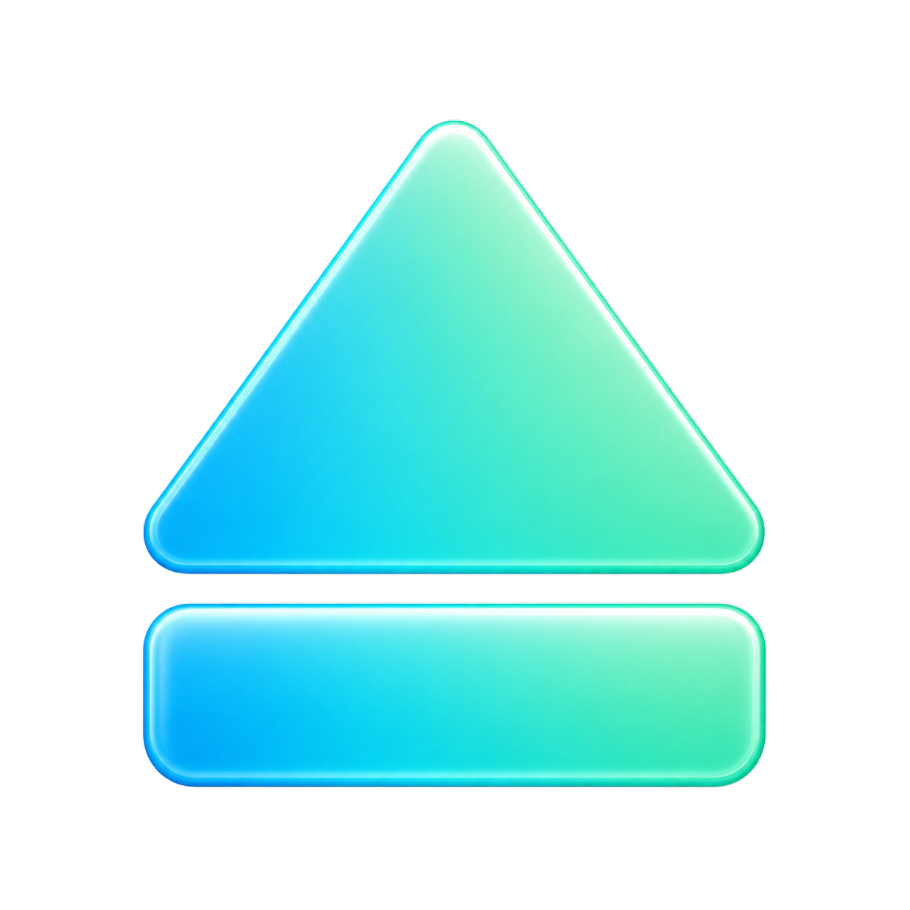

<div align="center">



# DiskOUT

[한국어](README.md) · **English** · [日本語](README.ja.md) · [简体中文](README.zh-Hans.md)

### Introducing DiskOUT — a free Mac utility.

**한국어 · English · 日本語 · 中文 (简体)** · Auto-eject on sleep · Apple Silicon native

<br>

[](https://github.com/yooongZa/DiskOUT/releases/latest)


[Download](https://github.com/yooongZa/DiskOUT/releases/latest) ·
[Changelog](CHANGELOG.md) ·
[Issues / Feedback](https://github.com/yooongZa/DiskOUT/issues)

</div>

---

> Mac is perfect — except for the *"Disk Not Ejected Properly"* notification.

## You do nothing. The disk ejects properly. Perfectly.

Now close the lid, unplug, bag — and go.

Apple's SSD prices are insane. And they're not even upgradeable. You get by with external drives, but those *"Disk Not Ejected Properly"* notifications are exhausting. With **DiskOUT**, you don't have to see them anymore.

---

## How?

### 1️⃣ The moment your lid closes, every external safely ejects.

Close → eject. Open → remount.
Sleep → eject. Wake → remount.

### 2️⃣ Eject 10 externals at once.

One shortcut, or one right-click on the menu bar icon — all of them, gone.

### 3️⃣ See how many drives are connected, at a glance.

The menu bar shows the count as a number.

---

## Designed to be safe

|  |  |
|---|---|
| **Time Machine auto-protect** | TM backup disks are automatically excluded from auto-eject — no accidental backup interruption |
| **Ignores DMG / disk images** | Mounted disk images don't appear in the menu and aren't auto-ejected |
| **No "improperly ejected" warnings** | Sleep eject tries a normal unmount first — macOS "improperly ejected" notifications don't fire |
| **Per-disk opt-out** | Exclude specific disks from auto-eject individually. Volume UUID-based, so it survives cable/port changes |
| **No ads, no tracking** | Focused on disk ejection. No external traffic outside of update checks |
| **Developer ID + Apple notarized** | Passes Gatekeeper — no "unidentified developer" warning, just opens |
| **Gentle auto-update** | A small red dot in the menu bar + an item in the menu announces new versions. No modal pop-ups. Installed only after EdDSA + Apple Code Signing double verification |

---

## Download

<div align="center">

### [Get the latest release →](https://github.com/yooongZa/DiskOUT/releases/latest)

`DiskOUT-X.Y.Z.dmg` · ~3MB · Apple Silicon only

</div>

### Install (30 seconds)

1. Double-click the DMG → drag DiskOUT to **Applications**
2. On first launch, macOS asks once → click **Open**
3. A number appears in your menu bar (`0` if no externals)

### Requirements

- macOS 14 (Sonoma) or later
- Apple Silicon (M1 / M2 / M3 / M4)

---

## Usage

| Action | How |
|---|---|
| Eject one drive | Menu bar icon → click drive name |
| Eject all | Menu "Eject all" or <kbd>⌥</kbd><kbd>⌘</kbd><kbd>E</kbd> |
| Quick eject all | **Right-click** the menu bar icon |
| Eject + Sleep | Menu "Eject and Sleep" — sleep only starts if all eject succeed |
| Mount unmounted externals | Click the bottom menu section or <kbd>⌃</kbd><kbd>⌘</kbd><kbd>E</kbd> |
| Mount + open in Finder | <kbd>⌘</kbd>+click an unmounted drive |
| Settings | Menu "Settings..." or <kbd>⌘</kbd><kbd>,</kbd> |

### Auto-launch at login

Toggle **"Launch at login"** in the menu → registered with macOS automatically. If macOS asks for additional approval, allow once in System Settings → General → Login Items.

---

## FAQ

<details>
<summary><b>Why isn't it in the App Store?</b></summary>

Mount/eject operations are heavily restricted in the sandbox environment. Stability would suffer, so we went with direct Developer ID distribution. Apple notarization means Gatekeeper still recognizes it as a trusted app.

</details>

<details>
<summary><b>Is it safe? Any risk of data loss?</b></summary>

Manual eject uses the standard `diskutil eject` path (the same as Finder's "Eject"). Auto (sleep) eject tries a normal unmount first and only falls back to force unmount if needed. For busy drives, the holding process is diagnosed via `lsof` and shown in the notification.

If even force unmount fails, the disk is left alone — we won't risk data corruption with a hard eject.

</details>

<details>
<summary><b>Is it free?</b></summary>

Currently a free download. The license is "All rights reserved" to keep future flexibility, but individual users can download and use it without restriction.

</details>

<details>
<summary><b>Can I download without a GitHub account?</b></summary>

Yes. `yooongZa/DiskOUT` is a public repository, and the DMG on GitHub Releases is anonymously downloadable. No GitHub sign-up or login required.

</details>

<details>
<summary><b>Does it work on Intel Macs?</b></summary>

Current builds are Apple Silicon only. No Intel builds planned.

</details>

<details>
<summary><b>I'm still seeing "improperly ejected" warnings</b></summary>

DiskOUT's sleep eject tries a normal unmount first, so this notification usually doesn't appear. When it does, common causes:

- **An app is holding the disk → normal unmount fails → force fallback runs**: when "force fallback" is ON in settings
- **macOS started ejecting first**: another system component beat us to it before sleep

Fix: quit the app holding the external before sleeping, or turn "force fallback" OFF in settings.

</details>

---

## Known limitations

- **Clamshell mode (external monitor + power + lid closed)**: macOS doesn't enter sleep → auto-eject doesn't trigger. Dock disconnects also won't happen here, so it's safe.
- **Busy drives**: Force unmount is attempted after normal unmount fails, but if an app still holds the disk, there's residual data risk.
- **User unplugged during sleep**: out of our control. If you need a safe-eject during sleep, use <kbd>⌥</kbd><kbd>⌘</kbd><kbd>E</kbd> — it wakes + ejects in one go.
- **Remount reliability**: Only disks that DiskOUT auto-ejected are remounted on wake. Physically removed disks can't be remounted by software.

See [CHANGELOG.md](CHANGELOG.md) for technical details.

---

## All features

<details>
<summary>Expand the feature matrix</summary>

| Feature | Description |
|---|---|
| Menu bar dropdown | Lists connected externals. Stale cache shown immediately, then background-refreshed when complete. On refresh failure, the previous cache stays + a failure row is shown. **DA event-driven inventory is the primary source** → menu stays responsive even when `storagekitd` is blocked (e.g. by SD card insertion) |
| **Menu bar icon = mount count** | Number of mounted external *devices* shown as text — 0, 1, 2, … (no upper limit). Multi-partition / RAID / APFS synthesized volumes count as 1. Event-driven auto-update from `DAInventory` changes (no polling). Temporary glyphs (↻ · ✓ · ✗) shown during eject progress/results |
| Individual eject | Click drive name |
| Eject all | Menu item or shortcut |
| **Eject and Sleep** | Menu item. Sleep-class volume-first force unmount path tries to eject everything, and only on full success does it call `pmset sleepnow`. Any failure → sleep canceled + notification |
| Global hotkey (eject) | Default <kbd>⌥</kbd><kbd>⌘</kbd><kbd>E</kbd> (IME-independent, physical key code comparison). Preset configurable in settings |
| Global hotkey (mount) | Default <kbd>⌃</kbd><kbd>⌘</kbd><kbd>E</kbd> — bulk mount unmounted externals. Configurable |
| Right-click = eject all | Right-click or ctrl+left-click the menu bar icon. Disable in Settings → Eject Behavior for opt-out (prevents accidental ejection) |
| **Mount unmounted externals** | Auto-shown menu section when candidates exist. Click = mount, <kbd>⌘</kbd>+click = mount + open in Finder |
| **Mount state consistency** | `diskutil list -plist external` snapshot calculates mounted / unmounted together, reducing stale state in the mounted section |
| **Disk-type icons** | `sdcard` icon when `diskutil info -plist` confirms SD card signals, `externaldrive` family otherwise |
| **Eject on sleep** | Menu toggle. IOKit power notification delays sleep briefly, then for each disk: normal DA unmount (whole-disk first) → DA force unmount (whole-disk first) → `diskutil unmountDisk force` → `eject force`. Normal unmount passing means macOS doesn't fire the improper-eject notification |
| **Eject on display sleep (optional)** | Menu toggle, default OFF. Designed for `pmset sleep=0` (auto-sleep disabled) setups — prevents dock-disconnect mishaps. Same 5-stage path. Explicit opt-in due to frequent firing concerns |
| **Auto-remount on wake / display wake** | Only disks successfully auto-ejected get remounted. If enumeration fails, treated as user-removed and stays silent |
| **DMG / sparseimage exclusion** | Mounted images filtered via `hdiutil info -plist` (1s timeout) + `diskutil info` fallback. Unmounted candidates excluded by `BusProtocol == "Disk Image"` |
| Eject path | Manual eject: `diskutil eject <volumePath>` → on failure, `diskutil unmount force <volumePath>` fallback. Sleep / display sleep / "Eject and Sleep": 5-stage **normal DA unmount (whole disk first, 2s)** → **DA force unmount (whole disk first, 3s)** → `diskutil unmountDisk force` (6s) → `diskutil eject force` (5s) → `diskutil eject` (3s). Normal unmount passing means no improper-eject notification. APFS multi-volume containers handled via whole-disk option. On final failure, manual path adds `lsof` diagnosis of holding process / open files to the notification |
| Result notifications | **Silent** banner + menu bar icon ✓ / ⚠ / ✗. Only negative outcomes (failures, remount failures, sleep eject failures) or background events are kept in Notification Center; user-triggered successes show a brief banner only |
| Parallel eject | `DispatchGroup` for N drives ejected concurrently |
| **Launch at login** | Menu toggle. `SMAppService.mainApp`. `.requiresApproval` state is shown with a check + "Login item needs approval" label |
| **Settings window** | <kbd>⌘</kbd><kbd>,</kbd> or menu "Settings...". Tabs for Launch / sleep behavior / Music & Photos / hotkeys / notifications / force fallback / right-click setting / About |
| **Hotkey conflict auto-fix** | If eject / mount / eject-and-sleep would share the same preset, the conflict is detected + one is auto-moved + alerted |
| **Missing-permission menu hint** | If Accessibility (for global hotkeys) or notification permission is missing, a ⚠ warning row appears at the top of the menu. Click to jump to the relevant System Settings page |
| **Fine-grained notification toggles** | Separate toggles for all / success / failure notifications. All ON by default |
| **Localization (ko + en + ja + zh-Hans)** | `Localizable.xcstrings` with 105 keys. First launch auto-matches system language (with English fallback for unsupported languages) + the Language popup in Settings → General lets you force a choice |
| **Auto-update (Sparkle 2)** | 24h background check. On new version, no modal — just a small systemRed `●` in the menu bar + "🔴 New version X.Y.Z available" menu item (gentle reminder). Click → standard Sparkle download/install dialog → auto-restart. EdDSA(Ed25519) + Apple Code Signing double verification. Appcast on GitHub Pages, DMG on GitHub Releases — free hosting |
| **Per-disk auto-eject exclude** | Submenu toggle "Exclude from auto-eject" on each disk's menu item. Volume UUID-based (survives cable/port changes). Affects auto path only — explicit eject still works |
| **Time Machine auto-protect** | TM backup disks auto-detected (`Backups.backupdb` / `.com.apple.timemachine.donotpresent`) → excluded from auto-eject on first sighting + 1 notification. Menu shows clock icon + *(Time Machine)* label |
| **External library app handling** | Menu toggle (default OFF). When ON, Music / Photos are auto-quit before sleep (frees up external library locks for ejection), auto-relaunched in the background after wake |

</details>

---

## Developer notes

<details>
<summary>Expand build · install · technical notes</summary>

### Tech stack

| Item | Value |
|---|---|
| Bundle ID | `com.yongza.ejectdrives` |
| Hardened Runtime | YES |
| App Sandbox | **NO** (`ENABLE_APP_SANDBOX = NO`) |
| Build system | Xcodegen + xcodebuild |
| Entry point | `main.swift` (explicit `NSApplication.shared.run()`) |
| Disk ops | Manual eject uses `/usr/sbin/diskutil` directly. Sleep / display sleep / "Eject and Sleep" use the 5-stage normal unmount → force unmount → `diskutil` fallback path via `Disk Arbitration API` |

### Files

```
diskOUT/
├── AppDelegate.swift            # Main logic (diskutil exec, menu cache, sleep/wake handling)
├── Localizable.xcstrings        # ko + en + ja + zh-Hans translations (Xcode String Catalog, 105 keys)
├── main.swift                   # Explicit entry point (NSApp.run)
├── Info.plist                   # bundle metadata (xcodegen generated)
├── DiskOUT.entitlements         # empty plist. Prevents entitlements pitfalls in project.yml
├── project.yml                  # xcodegen config (sandbox OFF)
├── DiskOUT.xcodeproj/           # Xcode project (regeneratable via xcodegen)
├── CHANGELOG.md
└── README.md
```

### Build

**One-time (project generation)**

```bash
cd ~/Documents/diskOUT
xcodegen generate                  # project.yml → DiskOUT.xcodeproj
```

**Each build**

```bash
cd ~/Documents/diskOUT
xcodebuild -project DiskOUT.xcodeproj -scheme DiskOUT -configuration Release \
  -derivedDataPath /tmp/DiskOUT-derived build
pkill -f DiskOUT
rm -rf ~/Applications/DiskOUT.app
cp -R /tmp/DiskOUT-derived/Build/Products/Release/DiskOUT.app ~/Applications/
open ~/Applications/DiskOUT.app
```

Or open `DiskOUT.xcodeproj` in Xcode → <kbd>⌘</kbd><kbd>R</kbd>.

**Safe install (rollback-capable)**

Recommended when a new build hasn't been fully verified. Backs up the existing `.app` before replacement.

```bash
# 1. Build
cd ~/Documents/diskOUT
xcodebuild -project DiskOUT.xcodeproj -scheme DiskOUT -configuration Debug build

# 2. Stop + backup + replace
pkill -f DiskOUT
mv ~/Applications/DiskOUT.app ~/Applications/DiskOUT.app.prev.bak
DERIVED=$(find ~/Library/Developer/Xcode/DerivedData -name "DiskOUT.app" -type d | head -1)
cp -R "$DERIVED" ~/Applications/DiskOUT.app
xattr -cr ~/Applications/DiskOUT.app   # clear provenance/quarantine
open ~/Applications/DiskOUT.app

# 3. Verify
log show --predicate 'subsystem == "com.yongza.ejectdrives"' --info --last 1m

# 4a. If OK, drop the backup
rm -rf ~/Applications/DiskOUT.app.prev.bak

# 4b. If problems, rollback
pkill -f DiskOUT
rm -rf ~/Applications/DiskOUT.app
mv ~/Applications/DiskOUT.app.prev.bak ~/Applications/DiskOUT.app
open ~/Applications/DiskOUT.app
```

### Where to change options

Most things are in the menu's **Settings...**. Code-only items:

| To change | Location |
|---|---|
| Add a hotkey preset | `SettingsHotkeyPreset` in `AppDelegate.swift` |
| Auto-eject default | `SleepEject.enabled` default value |
| Remount backoff intervals | `delays: [0, 1, 3, 7]` in the `tryRemount(bsd:delays:operationID:)` call |
| Menu text | The strings inside `populateMenu(_:snapshot:isRefreshing:)` |

Key codes use Carbon `Events.h` `kVK_ANSI_*` constants.

### Diagnostic note — `NSStatusBarWindow` height = 0

Early in development, the status item wouldn't appear in the menu bar. Code was 100% correct (NSLog firing, statusItem / button / image all created normally), but nothing was visible. Diagnosis:

```
DIAG: NSApp.windows.count=1
DIAG window: class=NSStatusBarWindow frame=(0.0, 0.0, 32.0, 0.0) visible=true level=25
                                                            ^^^ height=0
```

`NSStatusBarWindow` was created inside the process but never registered with `WindowServer`, or stuck at height=0. Likely a new macOS 26 policy or subtle status-item-system change.

**Workaround** (in `AppDelegate.swift`'s `setupStatusItem`):

```swift
if let win = button.window {
    let thickness = NSStatusBar.system.thickness
    win.setFrame(NSRect(x: 0, y: 0, width: 32, height: thickness),
                 display: true, animate: false)
    win.orderFrontRegardless()
}
```

Without these two lines, the menu bar item doesn't show.

### Diagnostic note — external drive filter

Original filter:

```swift
guard !isInternal, isBrowsable, (isEjectable || isRemovable) else { continue }
```

On macOS 26, some Thunderbolt external SSDs / certain USB drives report `isEjectable=false, isRemovable=false`. Updated:

```swift
guard !isInternal, isBrowsable, isLocal else { continue }
```

`isLocal` guard excludes network mounts only. All external disks pass.

### Other small bits

- **Notch models**: status items can land on the menu bar's left side (next to app menu) — when the right side fills up, items spill over the notch to the left.
- **`com.apple.provenance` xattr**: macOS fileprovider services (iCloud Drive / OneDrive etc.) auto-attach this to files in `~/Documents/`. codesign rejects with "resource fork, Finder information, or similar detritus not allowed". `xattr -cr` clears it but it comes back. **Build in `/tmp/` or another fileprovider-free location for safety.**
- **CGWindowList limitation**: `kCGWindowOwnerName == "DiskOUT"` may return 0 windows even when the menu bar item is visible. `ControlCenter` can draw the status item's view inside its own window, hiding it from external queries.
- **`ProcessRunner` stdout/stderr drain**: `Process` stdout/stderr drained asynchronously via `readabilityHandler`, with leftover data collected after termination. `lsof` 3s timeout, `pmset sleepnow` 5s timeout.

</details>

---

<div align="center">

**DiskOUT** · © 2026 LIMOD · All rights reserved

[Releases](https://github.com/yooongZa/DiskOUT/releases) ·
[Changelog](CHANGELOG.md) ·
[Issues](https://github.com/yooongZa/DiskOUT/issues)

</div>
