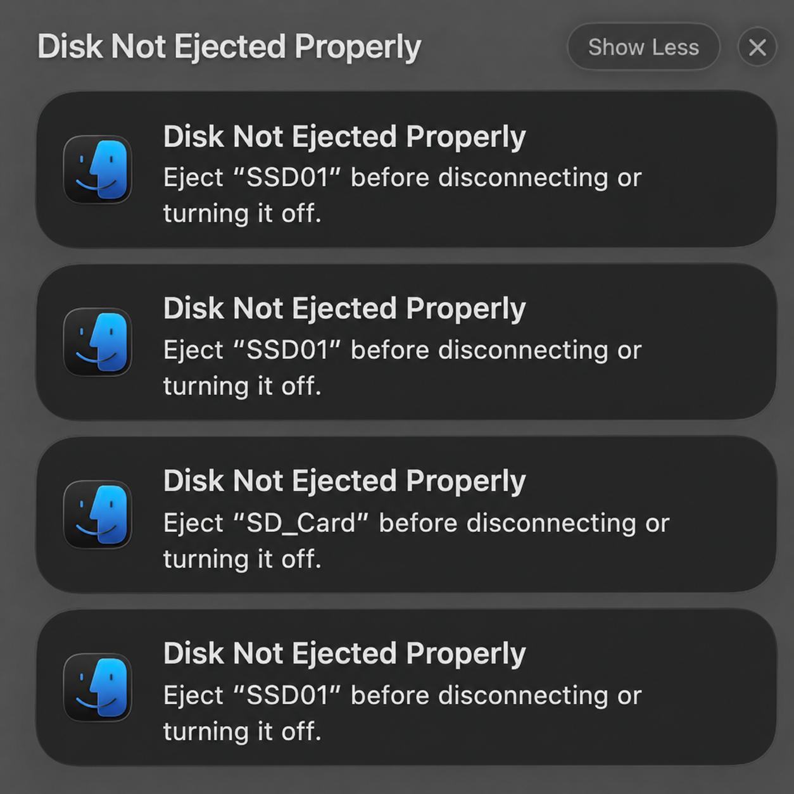

<div align="center">


# DiskOUT

[한국어](README.md) · [English](README.en.md) · **日本語** · [简体中文](README.zh-Hans.md)

## 「ディスクの不正な取り出し」を、もう見ない。



**DiskOUTは通知を隠すアプリではありません。**

蓋を閉じるときや設定したアイドルスリープの前に外付けドライブの正常な取り出しを試み、警告が出る状況を防ぎます。

[](https://github.com/yooongZa/DiskOUT/releases/latest)

基本機能は無料 · macOS 13+ · Apple Silicon · Apple 公証済み

[ダウンロード](https://github.com/yooongZa/DiskOUT/releases/latest) ·
[変更履歴](https://github.com/yooongZa/DiskOUT/releases) ·
[Issue / フィードバック](https://github.com/yooongZa/DiskOUT/issues) ·
[利用規約](TERMS.md) · [返金ポリシー](REFUND_POLICY.md) · [プライバシー](PRIVACY.md)

</div>

---

## 毎回Finderを開く必要はありません

- 蓋を閉じたときの自動取り出しを有効にすると、MacBookを閉じた際に正常な取り出しを試みます。
- 設定したアイドルスリープの前にも自動で取り出せます。
- DiskOUTがcleanに取り出したディスクは、次のwakeでも接続されていれば再マウントします。
- メニューやショートカットから、個別取り出し・すべて取り出し・`取り出してスリープ`を実行できます。

> 取り出し完了を確認してからケーブルを外してください。完了前や失敗後に外すと、macOSの警告が表示される場合があります。

## 書き込み中のドライブは別に扱います

DiskOUTは通常のアンマウントを先に試します。手動の取り出しと`取り出してスリープ`は書き込み中なら先に確認し、失敗した場合は原因と次の操作を表示します。Time Machineディスクと除外したドライブは自動取り出しの対象外です。

取り出し・マウント・スリープ自動化と数字のメニューバー表示は無料です。USD 4.99の買い切りPremiumは、数字をメニューバーキャラクターに変えるオプション機能です。

---

## ダウンロード

<div align="center">

### [最新リリースを入手 →](https://github.com/yooongZa/DiskOUT/releases/latest)

`DiskOUT-X.Y.Z.dmg` · Apple Silicon 専用

</div>

### インストール (30 秒)

1. DMG をダブルクリック → **アプリケーション**フォルダにドラッグ
2. 初回起動時に macOS が一度確認 → **開く**をクリック
3. メニューバーに数字アイコンが表示 (外付けがなければ `0`)

### システム要件

- macOS 13 (Ventura) 以降
- Apple Silicon (M1 / M2 / M3 / M4)

---

## 使い方

| 動作 | 方法 |
|---|---|
| Finder で開く / 個別取り出し | メニューバーアイコン → ドライブ名クリック / <kbd>⌘</kbd>+クリック |
| 全て取り出し | メニュー「全て取り出し」または <kbd>⌥</kbd><kbd>⌘</kbd><kbd>E</kbd> |
| 即座に全て取り出し | メニューバーアイコン**右クリック** |
| 取り出して スリープ | メニュー「取り出してスリープ」— すべて成功した場合のみスリープ開始 |
| マウントされていない外付けをマウント | メニュー下部セクションをクリックまたは <kbd>⌃</kbd><kbd>⌘</kbd><kbd>E</kbd> |
| マウント + Finder で開く | マウントされていない外付けに <kbd>⌘</kbd>+クリック |
| 環境設定 | メニュー「設定…」または <kbd>⌘</kbd><kbd>,</kbd> |

### ログイン時自動起動

設定 → 一般の**「ログイン時に起動」**で設定します。macOS が追加承認を求める場合、システム設定 → 一般 → ログイン項目で一度許可してください。

---

## FAQ

<details>
<summary><b>App Store に出ていない理由は?</b></summary>

mount / eject などのディスク操作は sandbox(サンドボックス) 環境で制約が多いです。安定性を十分に確保しにくいため、Developer ID 直接配布の路線を取りました。代わりに Apple 公証(notarization) を受けているため Gatekeeper は問題なく通過します。

</details>

<details>
<summary><b>安全ですか? データ損失の危険は?</b></summary>

DiskOUTが管理するすべての取り出しは、Disk Arbitrationの`kDADiskUnmountOptionWhole`で物理ディスク全体のnormal unmountから開始します。設定が有効な手動取り出し・「取り出してスリープ」・蓋を閉じたときは、busy応答または2秒以内にclean callbackがない場合に`Whole|Force`を1回試します。idle/display/forced sleepではForceしません。cleanに取り出した同一物理ディスクが次のwakeでも接続されていれば再マウントします。

ただし、force 段階まで進んでも取り出せないディスクはそのままにして通知だけ出します — データ危険を冒してまで強制取り出しはしません。

</details>

<details>
<summary><b>無料ですか?</b></summary>

はい。取り出し・マウント・スリープ自動化と従来の数字表示は無料のままです。任意の Premium メニューバーキャラクターは USD 4.99 の買い切りです。production 決済設定が完了するまでは、開発ビルドに購入メニューは表示されません。

</details>

<details>
<summary><b>Premium を新しい Mac に移せますか?</b></summary>

はい。購入後に設定 → Premium の「復旧コードをコピー…」で recovery code(復旧コード)を保管し、新しい Mac で入力すると Premium を移行できます。移行後、以前の Mac は次回のオンライン確認で利用できなくなります。サーバーに接続できない間も、最後に検証した利用権は最大 30 日間維持されます。

</details>

<details>
<summary><b>GitHub アカウントなしでダウンロードできますか?</b></summary>

はい。`yooongZa/DiskOUT` は public リポジトリで、GitHub Releases の DMG も匿名でダウンロード可能です。GitHub への登録 / ログイン不要です。

</details>

<details>
<summary><b>Intel Mac でも動きますか?</b></summary>

現在のビルドは Apple Silicon 専用です。Intel ビルドの予定はありません。

</details>

<details>
<summary><b>「取り出し失敗」通知が出るのですが</b></summary>

DiskOUT の自動(スリープ)取り出しは正常 unmount 段階を先に試すため、通常は通知が出ません。それでも出るとしたら、通常以下のケースです。

- **ディスクがbusy、またはnormal完了が遅い**: **強制アンマウントを許可**がONの手動取り出し・「取り出してスリープ」・蓋を閉じたときは、busyまたは2秒間clean callbackがない場合に`Whole|Force`を1回試行。idle/display/forced sleepではForceしない。
- **macOS が先に取り出しを始めたケース**: スリープ直前に他のシステムコンポーネントが先に試行。

解決: 外付けにアクセスしていたアプリを終了してからスリープするか、設定で**強制アンマウントを許可**をOFFにしてください。

</details>

---

## 既知の制限

- **クラムシェルモード (外部モニタ + 電源 + 蓋を閉じる)**: macOSがスリープしなくても、raw lid-close信号で自動取り出しは開始されます。クラムシェルモードで作業を続ける場合は、蓋を閉じたときの自動取り出しをOFFにしてください。
- **スリープ原因の判定**: macOSの公開IOKit通知は正確な要求元を示しません。active/unknown判定でもWhole normalを実行し、原因判定はForceを許可するかどうかだけに使用します。
- **使用中ドライブ**: 手動取り出し・「取り出してスリープ」・蓋を閉じたときは、busyまたは2秒のclean callback timeout後にforce unmountを1回試すことがあり、進行中の作業が中断される可能性があります。idle/display/forced sleepはnormal Wholeのみです。
- **正常完了前のケーブル切断**: clean callback前または取り出し失敗後にケーブルを抜くと、macOSの不正取り出し警告が出る場合があります。成功を確認してから取り外してください。
- **再マウントの信頼性**: DiskOUTがcleanに取り出した正確に同一の物理ディスクだけを次のwake後に再マウントします。物理的にすでに抜けたディスクはアプリで再マウントできません。

詳しい技術的制限は [リリースノート](https://github.com/yooongZa/DiskOUT/releases) を参照してください。

---

## 全機能

<details>
<summary>機能マトリクスを展開</summary>

| 機能 | 説明 |
|---|---|
| メニューバードロップダウン | 接続中の外付けドライブリスト。stale cache(古いキャッシュ) は即時表示し、background refresh(バックグラウンド更新) 完了後にメニューを再構築してウィンドウを開く遅延を減らす。更新失敗時は既存 cache を維持して失敗 row(行) を表示。**更新 source は DA event-driven インベントリが 1 番目** → SD カード挿入で `storagekitd` が詰まってもメニュー即座に正常 |
| **メニューバーアイコン = ⏏ + マウント数** | 取り出しグリフ (⏏) とマウントされた外付け*デバイス*数を並べて表示 — どのアプリの数字か一目で識別でき、等幅数字でカウントが変わっても幅が揺れない。0 台ならグリフのみ (情報のない「0」は省略)。マルチパーティション · RAID · APFS 合成ボリュームは 1 個に集計。`DAInventory` 変化にイベント基盤で自動更新 (ポーリングなし)。取り出し進行 / 結果表示中は臨時シンボル (↻ · ✓ · ✗) が優先、切り替えは 0.15s フェード (「視差効果を減らす」尊重) |
| **読み書きアクティビティ表示** | 外付けに読み込み・書き込み I/O が進行中なら、メニューバーの数字の横に小さな systemBlue `●` +「読み込み中 / 書き込み中 — 取り外さないでください」tooltip (アップデート通知の赤い `●` と色で区別)。メニューでは**その busy なディスク項目の横にだけ**青い `●` — tooltip で読み込み・書き込み・両方を区別。物理ディスクの I/O カウンタ (IORegistry) を 1.5s ポーリング、ボリューム→物理マッピングは parent-walk で RAID · APFS 合成 · 直結すべて処理。読み込みは background インデックスの誤検出防止のため閾値が高め。取り出し後、最新のマウント一覧と物理マッピングを確認できると、そのディスクの青い点を削除し、引き続きマウント中のほかのディスクの状態は維持。外付けがある時だけ稼働 (バッテリー) |
| **ディスク容量 / 使用率** | 各ディスクのメニュー項目の 2 行目に*空き容量 · 使用率* を表示 — 例 `2.9 TB 空き · 40% 使用`。メニューを開く時に `URLResourceValues` で取得 (プロセス起動なし) |
| Finder で開く / 個別取り出し | ドライブ名クリック = Finder で開く、<kbd>⌘</kbd>+クリック = 個別取り出し。一覧の上に標準メニューサイズの薄い `クリック：Finderで開く` / `⌘クリック：取り出す` ガイドを2行で1回だけ表示し、ドライブ行には名前・状態・容量のみを表示 |
| **書き込み中の取り出し確認** | 書き込み中のディスクを手動で取り出す場合、または **「取り出してスリープ」**を選んだ場合は、キャンセルを既定とする警告を表示。設定が有効な蓋閉じはbusyまたは2秒のclean callback timeout後にForceを1回実行でき、idle/display/forced sleepではForceしない |
| **占有アプリ終了して再試行** | 取り出し失敗時、ディスクを掴んでいる*終了可能な一般アプリ*があれば通知に「アプリを終了して再試行」ボタン。押すと graceful 終了 (`forceTerminate` は使わない) → 1 回再取り出し。Finder · システムデーモン · 自分自身は除外 |
| 全て取り出し | メニュー項目またはショートカット |
| **取り出してスリープ** | 物理ディスクごとにDA Whole normalを並列実行し、**強制アンマウントを許可**がONでbusyまたは2秒間clean callbackがなければ`Whole|Force`を1回。10秒以内に全てclean成功した場合だけ`pmset sleepnow`を実行し、同一物理メディアを実際のwakeで再マウント |
| グローバルホットキー (取り出し) | デフォルト <kbd>⌥</kbd><kbd>⌘</kbd><kbd>E</kbd> (日 / 英 IME 無関係、物理キーコード比較)。環境設定で E ベースの preset(プリセット) 変更可能 |
| グローバルホットキー (マウント) | デフォルト <kbd>⌃</kbd><kbd>⌘</kbd><kbd>E</kbd> — マウントされていない外付けを一括マウント。環境設定で変更可能 |
| 右クリック = 全て取り出し | メニューバーアイコン右クリックまたは ctrl+左クリック。環境設定 → Eject Behavior で OFF にすると右クリックがメニューを開く (誤取り出し防止 opt-out) |
| **マウントされていない外付けのマウント** | メニューに「マウントされていない外付け」セクション自動表示 (候補がある時のみ)。クリック = マウント、<kbd>⌘</kbd>+クリック = マウント + Finder で開く |
| **マウント / 未マウント状態の整合性** | `diskutil list -plist external` 1 つの snapshot(スナップショット) で mounted(マウント済み) / unmounted(マウントされていない) を一緒に計算し、実際にマウントがないのに mounted セクションに残る stale state(古い状態) を減らす |
| **ディスク種類アイコン** | `diskutil info -plist` の SD card 信号が確認されれば `sdcard` アイコン、その他外付けは `externaldrive` 系アイコンを使用 |
| **システムスリープ時**の自動取り出し | 設定 → 取り出しの動作で設定。idle sleep、Appleメニュー/電源キー、active/unknown判定のすべてでwhole-disk DA normalを試行。原因判定はForce policyだけを決定 |
| **画面が消える時も自動取り出し** (オプション) | 設定 → 取り出しの動作で設定、default OFF。`pmset sleep=0` 環境向け。whole-disk DA normal のみで、成功したディスクは画面復帰時に再マウント |
| **wake / 画面オン時再マウント** | DiskOUTがcleanに取り出した正確に同一の物理ディスクだけ再マウント。enumerate(列挙) されなければユーザーが分離したと見なして silent |
| **DMG / sparseimage 除外** | マウント済みイメージは `hdiutil info -plist` 1 秒 timeout + `diskutil info` fallback、unmounted 候補は `BusProtocol == "Disk Image"` で除外 |
| 取り出しパス | 手動・lid・idle・display・forced sleep・「取り出してスリープ」を含むDiskOUTの全取り出しはDA Whole normalから開始。policyと設定が許可する経路はbusyまたは2秒のclean無応答で物理ディスク・episodeごとにWhole Forceを最大1回。切断・unknown errorではForceしない |
| 結果通知 | **無音** バナー + メニューバーアイコン ✓ / ! / ✗ (circle 系シンボルに統一)。不在中発生または negative 結果 (失敗 · 再マウント失敗 · sleep 取り出し失敗) のみ**通知センターに保管**、本人 trigger + 成功はバナーのみ短時間表示 |
| 並列取り出し | `DispatchGroup` で N 個のドライブを同時取り出し |
| **ログイン時自動起動** | 設定 → 一般で設定。`SMAppService.mainApp` を使用し、`.requiresApproval` は混合状態と「承認が必要」ラベルで表示してシステム設定へ案内 |
| **環境設定ウィンドウ** | <kbd>⌘</kbd><kbd>,</kbd> またはメニューの「設定…」。システム設定式の**ツールバー 6 ペイン** — 一般 (ログイン · 言語 · エラー報告) / 取り出しの動作 (sleep · display sleep · Music/Photos · 強制アンマウント · 右クリック) / 通知 / ホットキー / Premium (購入 · 復元 · 状態) / About (バージョン · アップデート · リンク)。ペインごとに高さを自動調整し、分かりにくいオプションには説明行を表示 |
| **ショートカット衝突自動修正** | 取り出し / マウント / 取り出してスリープのショートカットが同じ preset で保存されると衝突検出 + 別 preset に自動移動 + alert |
| **権限不足メニュー案内** | Accessibility(アクセシビリティ) / 通知権限が許可されていない状態だとメニュー上部に ⚠ 警告 row 表示。クリックでシステム設定の該当ページへ移動 |
| **通知の詳細制御** | 全体通知、成功通知、失敗通知を個別に設定。デフォルトは全て ON。macOSのシステム設定で通知が許可されていない場合は状態を表示し、該当設定を直接開ける |
| **多言語 (ko + en + ja + zh-Hans)** | `Localizable.xcstrings` 177 個のキー。システムの優先言語リスト全体から最初の対応言語を選び、該当がない場合のみ英語にフォールバック。設定 → 一般 → Language でシステム設定または明示言語を選択可能 |
| **自動アップデート (Sparkle 2)** | 24 時間周期でバックグラウンドチェック。新バージョン発見時にダイアログを出さず**メニューバーアイコンに小さな systemRed `●` + メニュー内「X.Y.Z にアップデート…」項目 (同じ赤い点 prefix)** だけで表示 (gentle reminder)。ユーザーがクリックすると、状態メニューを閉じてから Sparkle の確認を開始し、確認中・アップデート案内・アップデートなし／エラーのモーダル各段階で、前面表示を限られた回数だけ再要求。EdDSA(Ed25519) + Apple Code Signing の二重検証。appcast ホスティングは GitHub Pages、DMG ホスティングは GitHub Releases — 無料運用 |
| **ディスク別自動取り出し除外** | メニュー下部の*「自動取り出しから除外されたディスク」* submenu でディスク別トグル。Volume UUID 基準 (ケーブルスロットが変わっても維持)。自動 path だけ影響、明示的取り出しはそのまま。 |
| **Time Machine 自動保護** | TM バックアップディスクを自動識別 (`Backups.backupdb` / `.com.apple.timemachine.donotpresent` 検査) → 初回登場時に自動取り出しから除外 + 1 回通知。メニューに時計アイコン + Time Machine バッジ表記 (macOS 14+、13 は括弧) |
| **外付けライブラリアプリ処理** | 設定 → 取り出しの動作のトグル (default OFF)。ON なら自動 sleep/display sleep の取り出し、または **「取り出してスリープ」**の直前に Music / Photos を正常終了して外付けライブラリの lock を解除。終了を受け入れたアプリだけを wake 後にバックグラウンドで1回再起動し、重複する sleep イベントでも再起動記録を失わない |

</details>

---

## 開発者向け

<details>
<summary>ビルド · インストール · 技術メモを展開</summary>

### 技術スタック

| 項目 | 値 |
|---|---|
| Bundle ID | `com.yongza.ejectdrives` |
| Hardened Runtime | YES |
| App Sandbox | **NO** (`ENABLE_APP_SANDBOX = NO`) |
| ビルドシステム | Xcodegen + xcodebuild |
| エントリポイント | `main.swift` (明示的 `NSApplication.shared.run()`) |
| ディスク操作 | 全取り出しはwhole-disk Disk Arbitration normal。許可された経路はbusyまたは2秒のclean timeout後にwhole-disk Forceを1回。同一BSD+接続世代+IOMedia IDのみ次のwakeで再マウント |

### ファイル構成

```
diskOUT/
├── AppDelegate.swift            # メインロジック (diskutil 実行、メニューキャッシュ、sleep/wake 処理)
├── LanguageRuntime.swift        # 言語ネゴシエーション・保存値検証・安全な再起動ポリシー
├── Localizable.xcstrings        # ko + en + ja + zh-Hans 翻訳 (Xcode String Catalog、177 キー)
├── main.swift                   # 明示的 entry point (NSApp.run)
├── Info.plist                   # bundle metadata (xcodegen 自動生成)
├── DiskOUT.entitlements         # 空の plist。project.yml の entitlements 明示でハマるのを防止
├── project.yml                  # xcodegen 設定 (sandbox OFF)
├── DiskOUT.xcodeproj/           # Xcode プロジェクト (xcodegen で再生成可能)
├── Tests/LanguageRuntimePolicyTests.swift # 言語フォールバック・保存値・再起動状態テスト
├── CHANGELOG.md
└── README.md
```

### ビルド

**一度だけ (プロジェクト生成)**

```bash
cd ~/Documents/diskOUT
xcodegen generate                  # project.yml → DiskOUT.xcodeproj
```

**毎ビルド**

```bash
cd ~/Documents/diskOUT
BUILD_WORK_DIR="/private/tmp/diskout-build.$(uuidgen)"
xcodebuild -project DiskOUT.xcodeproj -scheme DiskOUT -configuration Release \
  -derivedDataPath "$BUILD_WORK_DIR/DerivedData" build
printf 'Built app: %s\n' "$BUILD_WORK_DIR/DerivedData/Build/Products/Release/DiskOUT.app"
```

インストールには下のロールバック可能な手順を使用します。または Xcode で `DiskOUT.xcodeproj` を開き、<kbd>⌘</kbd><kbd>R</kbd> を押します。

**安全インストール (ロールバック可能)**

新ビルドの検証が終わっていない時に推奨。既存の `.app` を先にバックアップしてから置換。

```bash
set -euo pipefail

# 1. 明示した一時パスにビルドし、bundle ID を検証
cd ~/Documents/diskOUT
INSTALL_WORK_DIR="/private/tmp/diskout-install.$(uuidgen)"
SOURCE_APP="$INSTALL_WORK_DIR/DerivedData/Build/Products/Release/DiskOUT.app"
TARGET_APP="$HOME/Applications/DiskOUT.app"
BACKUP_APP="$HOME/Applications/DiskOUT.app.backup.$(uuidgen)"
xcodebuild -project DiskOUT.xcodeproj -scheme DiskOUT -configuration Release \
  -derivedDataPath "$INSTALL_WORK_DIR/DerivedData" build
[ "$(plutil -extract CFBundleIdentifier raw -o - "$SOURCE_APP/Contents/Info.plist")" = \
  "com.yongza.ejectdrives" ]

# 2. 正確な process だけを終了し、旧アプリを固有パスへ保存
mkdir -p "$HOME/Applications"
pkill -x DiskOUT 2>/dev/null || true
if [ -e "$TARGET_APP" ]; then
  mv "$TARGET_APP" "$BACKUP_APP"
  printf 'Rollback backup: %s\n' "$BACKUP_APP"
else
  BACKUP_APP=""
  printf 'Rollback backup: none (既存インストールなし)\n'
fi

# 3. 検証済み product だけをインストールして起動
ditto "$SOURCE_APP" "$TARGET_APP"
xattr -cr "$TARGET_APP"
open "$TARGET_APP"

# 4. 検証
log show --predicate 'subsystem == "com.yongza.ejectdrives"' --info --last 1m
```

問題がある場合は、上で表示された正確な backup パスを `BACKUP_APP` に設定します。現在のアプリも削除せず固有の failed パスへ保存してから復元します。

```bash
set -euo pipefail
TARGET_APP="$HOME/Applications/DiskOUT.app"
BACKUP_APP="<上で表示された Rollback backup の絶対パス>"
FAILED_APP="$HOME/Applications/DiskOUT.app.failed.$(uuidgen)"
[ -d "$BACKUP_APP" ]
pkill -x DiskOUT 2>/dev/null || true
mv "$TARGET_APP" "$FAILED_APP"
mv "$BACKUP_APP" "$TARGET_APP"
open "$TARGET_APP"
printf 'Failed build preserved at: %s\n' "$FAILED_APP"
```

検証後、不要な backup / failed アプリは Finder のゴミ箱へ移動します。

### オプション変更箇所

大部分はメニューの**設定…**で直接変更。コード修正が必要な項目だけ:

| 変えること | 位置 |
|---|---|
| ショートカット preset 追加 | `AppDelegate.swift` の `SettingsHotkeyPreset` |
| 自動取り出しデフォルト値 | `SleepEject.enabled` の default 値 |
| 再マウント backoff 間隔 | `tryRemount(bsd:delays:operationID:)` 呼び出し時の `delays: [0, 1, 3, 7]` 修正 |
| メニューテキスト | `populateMenu(_:snapshot:isRefreshing:)` の文字列 |

キーコードは Carbon `Events.h` の `kVK_ANSI_*` 定数を参照。

### 診断メモ — `NSStatusBarWindow` height = 0

初期ビルド中、メニューバーに status item が表示されない問題発生。コードは 100% 正常動作 (NSLog 出力、statusItem / button / image すべて正常生成) なのにメニューバーには見えなかった。診断:

```
DIAG: NSApp.windows.count=1
DIAG window: class=NSStatusBarWindow frame=(0.0, 0.0, 32.0, 0.0) visible=true level=25
                                                            ^^^ height=0
```

`NSStatusBarWindow` は process 内には作られたが、`WindowServer` に登録されていないか、height=0 で閉じ込められていた。macOS 26 の新ポリシーまたは status item システムの微妙な変更と推定。

**回避コード** (`AppDelegate.swift` の `setupStatusItem`):

```swift
if let win = button.window {
    let thickness = NSStatusBar.system.thickness
    win.setFrame(NSRect(x: 0, y: 0, width: 32, height: thickness),
                 display: true, animate: false)
    win.orderFrontRegardless()
}
```

この 2 行が抜けるとメニューバーに表示されない。

### 診断メモ — 外付けドライブフィルタ

元のフィルタ:

```swift
guard !isInternal, isBrowsable, (isEjectable || isRemovable) else { continue }
```

macOS 26 では Thunderbolt 外付け SSD / 一部 USB が `isEjectable=false, isRemovable=false` で報告されるケース発見。修正:

```swift
guard !isInternal, isBrowsable, isLocal else { continue }
```

`isLocal` ガードでネットワークマウントだけ除外。外付けディスクはすべて通過。

### その他の細かい情報

- **ノッチモデル**: status items がメニューバー左側 (アプリメニューの隣) にも配置されることがある — 右側が満杯になるとノッチを越えて左側に登場。
- **`com.apple.provenance` xattr**: macOS の fileprovider サービス (iCloud Drive / OneDrive など) が `~/Documents/` 内のファイルに自動で付ける。codesign がこれを見ると「resource fork, Finder information, or similar detritus not allowed」でサイン拒否。`xattr -cr` で整理してもすぐ再付着。**ビルドは `/tmp/` など fileprovider 影響のない場所で行うのが安全。**
- **CGWindowList の限界**: `kCGWindowOwnerName == "DiskOUT"` 検索でウィンドウ 0 個でもメニューバーに表示されていることがある。`ControlCenter` が status item の view を自身のウィンドウ内に描画するケースがあり外部からは見えない。
- **`ProcessRunner` stdout/stderr drain**: `Process` の stdout / stderr を `readabilityHandler` で非同期 drain し、終了後に残った data も回収。`lsof` は 3 秒 timeout、`pmset sleepnow` は 5 秒 timeout。

</details>

---

<div align="center">

**DiskOUT** · © 2026 LIMOD · All rights reserved

[リリース](https://github.com/yooongZa/DiskOUT/releases) ·
[変更履歴](https://github.com/yooongZa/DiskOUT/releases) ·
[Issue](https://github.com/yooongZa/DiskOUT/issues) ·
[利用規約](TERMS.md) · [返金ポリシー](REFUND_POLICY.md) · [プライバシー](PRIVACY.md)

</div>
